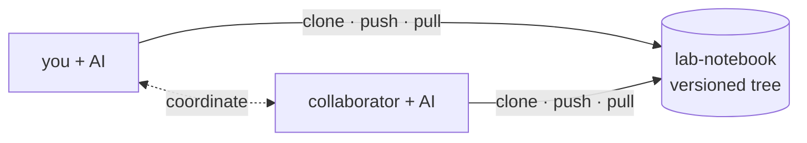
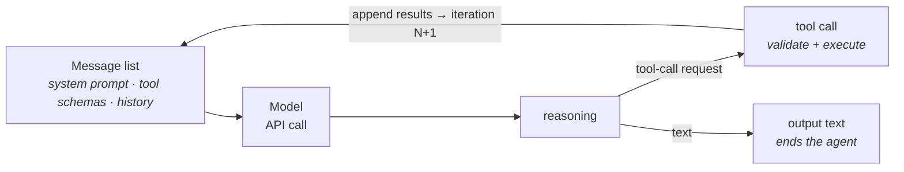
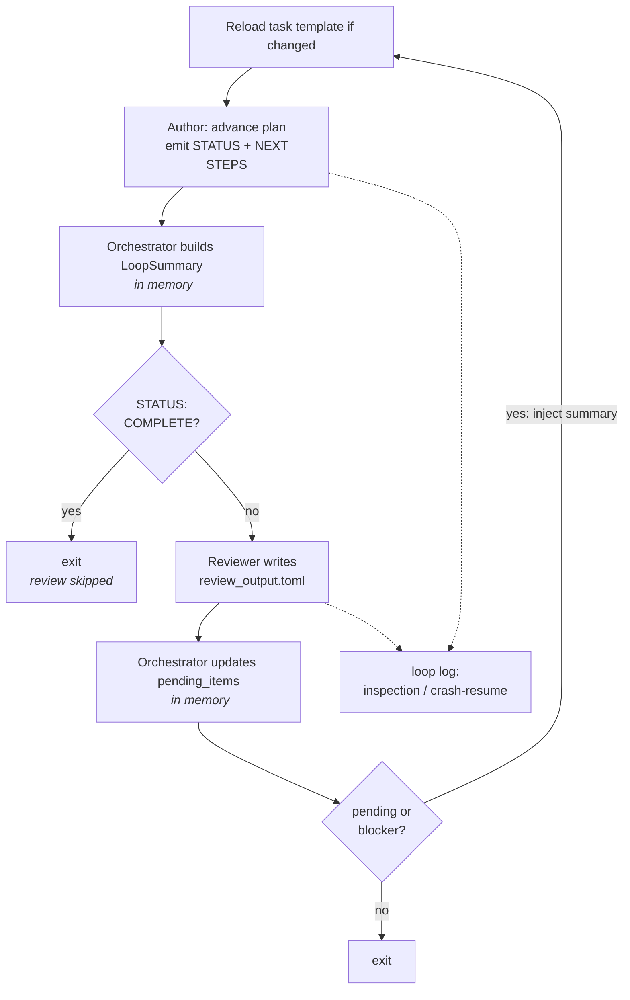

# Collaborative AI-Driven Workflows: a Lab Notebook

Scientific software is a critical research instrument, and it is chronically under-resourced.
The people who can safely modify a numerical code are usually the same people who understand
the science it encodes, and that expertise is scarce. The codebases are long-lived, carry
decades of implicit domain knowledge, and are held to strict correctness requirements by
design. These pressures make modernization work such as translation, refactoring, and
algorithmic change both desirable and expensive.

Large language models change the economics of that work, but their output is not guaranteed
to be correct. An agent driven by a single human can produce code that satisfies an existing
regression suite while still introducing silent numerical errors, and can erode the software
understanding a team depends on. The question is therefore not whether to use AI, but how to
structure its use so that the mechanical breadth of an agent is harnessed without giving up
scientific correctness.

This notebook is a small, working example of one answer. It is the reference implementation
for the workflow architecture described in our paper on collaborative AI-driven workflows for
scientific software engineering, and it demonstrates the architecture on a real task: the
modernization of [MCFM](https://mcfm.fnal.gov), a high-energy-physics matrix-element code,
from Fortran to C++ and onward to device-portable kernels for use with Pepper.

The rest of this page walks through the design, its three central structures, and how to run
the demo.

## Design principles

Four principles govern the workflows here. Each trades some raw throughput for a property
scientists can check.

**P1 — Correctness and verification at every boundary.** A translation is not finished when
it compiles or when an agent declares success; it is finished when a check that scientists
accept has passed. Verification is a structural feature rather than a final step: every stage
ends at a boundary where its output is measured before the next stage may consume it. An
artifact can link and run while never being exercised by the benchmark that supposedly
validates it, so the workflow must also confirm that the check actually reaches the code under
test before granting it credit.

**P2 — Humans own intent and acceptance; agents own mechanical breadth.** Agents are well
suited to wide, repetitive work: applying a known translation rule across hundreds of files,
rewiring build files, probing for coverage. Humans are needed where judgment is required:
deciding what "correct" means for a routine, resolving a subtle numerical disagreement,
accepting or rejecting a result. Agents expand breadth in parallel while humans retain a small
number of high-value decision points.

**P3 — Reproducibility and provenance.** Because the output of a transformation is never
guaranteed to be deterministic even when the orchestration is, the workflow records what was
done: which artifact was produced, which benchmark exercised it, and what agreement was
observed. State is kept in plain, human-readable files rather than in an agent's transient
context, so a run can be inspected, resumed, or reproduced.

**P4 — Collaboration across disciplines as a design goal.** Scientific software engineering
combines simulation developers, HPC specialists, and domain scientists. Work is packaged so a
domain expert can specify and review intent, a software engineer can author the reusable tools
agents invoke, and the two roles meet at the same verification boundary.

## Figure 1 — The lab notebook

The workflows here did not begin as an AI project. They were layered onto a shared execution
environment the team already used to track software provenance across several scientific
codebases, and they inherit its directory-based structure: an experiment is a directory tree
whose configuration is inherited down the tree and whose state can be archived as a provenance
record. The discipline behind the term comes from earlier arguments in the computational
science community that valuable science is lost without enforced record-keeping, and that
experimental-science practice can be carried into computational science by deliberately
designing virtual laboratory environments.

The agentic layer is built on that same foundation. The repository embeds the tools,
workflows, and context that drive the work alongside the code and configuration, so that
sharing the repository shares both the code and the means to continue the work.



Configuration is inherited downward from the top of the project. `environment.sh` holds a
uniform Unix shell configuration, while each collaborator's machine-specific customizations
live under `sites/<user>/config.sh`, letting them adapt the environment to their own system
without perturbing the shared file. Each subdirectory of `software/` tracks an individual
upstream repository, and the matching directories under `tests/` follow each code's own build
and verification practices.

```
lab-notebook/
├── .claude/
│   └── workflows/transform.js      orchestrator-specific adapter
├── environment.sh                  shared shell configuration
├── config.sh                       selects this machine's site
├── sites/<user>/config.sh          per-machine compilers and paths
├── software/                       upstream codes (git submodules)
│   ├── mcfm/                       $MCFM_HOME
│   ├── pepper/                     $PEPPER_HOME
│   └── qcdloop/                    $QCDLOOP_HOME
├── tests/                          each code's own verification practice
│   ├── mcfm/
│   └── pepper/
└── dev/                        ←   interaction layer for human-AI collaboration
    ├── workflow.py                 shared command line for humans and agents
    ├── tools/                      deterministic capabilities
    │   ├── index/
    │   └── draft/
    │   └── ...
    └── transformations/
        ├── mcfm-translate/
        │   ├── desired_spec.md     the Spec    (human-owned)
        │   ├── current_plan.md     the Plan    (human-owned)
        │   ├── agent_log.md        the Log     (agent-writable)
        │   ├── approvals.toml      the gate    (human-only)
        │   └── loop.toml           orchestrator configuration
        ├── mcfm-miniapp-threejets/ same Spec, scope fixed to one folder
        ├── mcfm-cleanup/
        ├── mcfm-fix-failures/
        └── pepper-kokkos-port/
```

### Miniapp transformations

An ordinary `mcfm-translate` run picks its own files: it reads the readiness map and takes
whatever is ready, so two runs rarely translate the same set. That makes cost and time hard to
compare across orchestrators.

A *miniapp* transformation fixes the work set to one self-contained `src/` folder, so different
orchestrators can be measured on exactly the same files. It reuses `mcfm-translate`'s
`desired_spec.md` byte for byte — the correctness contract does not change — and differs only in
the Plan, which is the policy that selects work. The readiness map is narrowed to match:

```bash
python3 dev/workflow.py refresh --scope ThreeJets
```

With `--scope`, `deps` and `fanin` count only edges whose other end is inside the folder, so
`deps == 0` means "ready within this miniapp". A file whose remaining untranslated callees are
all outside the folder is ready now, and the Spec's `extern "C"` rule covers calling them while
they are still Fortran. Unlike an open-ended run, a miniapp is not restricted to leaves, so the
ordering inside the folder is real work.

`mcfm-miniapp-threejets` is the first of these: 16 untranslated files in
`software/mcfm/src/ThreeJets`, one benchmark process (`g g g g g`), one `CMakeLists.txt`.

The agentic center of the notebook is `dev/`, where the modernization work lives. A project
may carry several transformations at once, each a work package under `dev/transformations`
holding a human-owned Spec and Plan, an agent log, and the configuration that drives the
agents. The deterministic tools that operate on a file or a list of files live under
`dev/tools`, exposed to both humans and agents through a single entrypoint, `dev/workflow.py`.
Orchestrator-specific layers such as `.claude/workflows` exist only as an alternative way to
perform transformations, alongside the CodeScribe loop.

Keeping this state on disk rather than in an agent's transient context is what lets a
transformation be paused, resumed, handed to a different orchestrator, or handed to a
teammate.

### Human-owned and agent-writable state

A long-running transformation mixes documents a human must keep authority over with working
notes an agent should be free to revise. The separation is deliberate: an agent may freely
update its log across iterations, but the record of what a human has actually accepted is
never agent-writable, so acceptance stays human-authored (P2).

| file | role | owner |
|------|------|-------|
| Spec `desired_spec.md` | the objective, the invariants, the correctness oracle, and the status contract — the *what* | human |
| Plan `current_plan.md` | the policy: which ready unit to act on, how to group work, how to run it — the *how* | human |
| Log `agent_log.md` | the state and its certificate: each unit's outcome with the evidence that earned it — the *record* | AI |
| Approvals `approvals.toml` | the gate's input: what a human has accepted | human |

## Vocabulary

The architecture rests on a small, composable vocabulary, used consistently throughout.

- **Agent** — the fundamental model-facing unit: direct interaction with a model, structured
  as iterative API calls containing prompt and context, model reasoning, tool-call requests
  and their results, and output. Reasoning, tool-calling, and prompt caching all happen here.
- **Subagent** — an agent invoked under the control of an orchestrator, in its own isolated
  context.
- **Orchestrator** — the controller that reads the shared inputs and drives one or more
  subagents through a workflow or loop. The two used here are CodeScribe and Claude Code.
- **Tool** — a reusable, deterministic coded capability the orchestrator invokes rather than a
  model call, such as computing a dependency layer or running a validator. A tool should
  ideally operate on a single file or a list of files.
- **Plan** — a human-specified checklist of tasks for a targeted portion of work, and
  instructions on how to run them.
- **Spec** — an informal specification of the desired code that serves as the reference and
  guidance for agent-generated code.
- **Workflow** — a deterministic, human-authored process an orchestrator runs to drive
  subagents. Determinism here refers only to how agents are orchestrated; the output of a
  transformation is never guaranteed to be deterministic.
- **Loop** — the minimal implementation of a workflow: a deterministic agentic loop whose
  working state persists across iterations, in the simplest case entirely as files on disk.
- **Transformation** — an agentic process that moves source code from one state to another.

## Staged transformations

Code modernization here is driven by integration: a client application needs a capability that
lives in a library written in a different language, and the target language is set by whichever
side the integration is organized around. MCFM's Fortran library is being ported to C++ so the
Pepper client can call it and run it on GPUs, where C++ affords the device portability the
physics campaigns require.

The work is decomposed into stages with a human-reviewed boundary between each. Rather than
fixing the decomposition up front, stages were identified through developer discussion,
starting from a testable core and expanding outward:

1. **Fortran to C++.** Each Fortran unit is rewritten as C++, emitting a trio of files per
   unit: a C++ implementation with an `extern "C"` wrapper, a C++ header, and an
   `iso_c_binding` Fortran interface so existing Fortran callers continue to link and run
   during the incremental migration. This interface-layer approach preserves interoperability
   throughout, rather than requiring a big-bang cutover. Correctness is checked by running
   MCFM's own tests, plus a coverage probe confirming the test really exercised the new code.
2. **C++ to Kokkos.** The approved C++ is rewritten again as Kokkos code that runs on GPUs,
   inside Pepper. Correctness is checked against Pepper's tests.

Stage boundaries serve two purposes at once: they are the verification points of P1 and the
collaboration points of P4. Because a testable core exists early, agents can expand breadth on
either side of it while humans judge acceptance at each boundary.

### Verification criteria

Correctness is anchored to the code's own benchmarks. A unit is **verified** only when a
benchmark actually exercises it and the resulting numerical ratios against the reference match
within a fixed tolerance; otherwise it is merely **translated** and is reported as unverified.
A passing benchmark alone is not enough, because a unit that lies off the benchmark's execution
path still reports a match without ever being tested. Units no available benchmark exercises,
such as pure infrastructure code, are reported as translated but not verified.

### A formal view

Each stage is an optimization over a repository `R`, advanced by *settling* units `u` — the
atoms of work (a source file, a translated module). Three quantities are computed
or checked, never guessed:

- Readiness `ρ(u)` — a unit is ready once its dependencies are settled, recovered from the
  dependency graph built by `dev/tools/index/build_roadmap.py`.
- Oracle `V(u)` — the correctness bar; the only source of truth for "correct."
- Status `σ(u) ∈ Σ` — the outcome recorded for a settled unit. `Σ` is fixed per stage by the
  Spec's status contract; each `σ` has a class (good / bad) and a reversibility, and a bad or
  irreversible `σ` is risky.

The orchestrator performs a constrained search over the *ready set* (ready, not-yet-settled
units):

> maximize progress `f(R)` — units in a good status — subject to the invariants `I` holding
> after every settled unit, acting only on ready units, until the ready set is empty.

Because each settled unit leaves the ready set and `ρ` is acyclic, the search terminates. Human
review is the control law: completed groups may accumulate up to a batch limit before approval,
and a risky `σ` requires approval at once.

## Figure 2 — Inside an agent: one iteration

Each agent is a bounded read–reason–act loop over chat-completion calls. A call carries the
running message list and the JSON schemas of the tools the agent may invoke; the model replies
either with output text, which ends the agent, or with one or more tool-call requests. Each
request's arguments are validated against the tool's schema, the tool is executed, and the
results are appended to the conversation as the next turn before the following call is issued.



The agent carries a single growing message list. The system prompt and seed turn are built
once, and every iteration appends the model's output together with its tool-call requests and
their results before the whole list is re-sent on the next call, so context grows monotonically
within a phase rather than being summarized between iterations. To keep this affordable, the
stable parts of each request are marked with explicit cache breakpoints, so one iteration's
written cache is read back by the next: iteration *N*'s `cache_read` is iteration *N-1*'s
`cache_write`.

A rejected tool call returns as an error the next iteration diagnoses and works around. The
`[tools].bash` allowlist in `loop.toml` is a hard guardrail: unlike the soft, natural-language
guardrails in the Spec and prompts, it is a bound the agent physically cannot exceed, and it is
what makes an otherwise open-ended loop safe to leave running.

```toml
[tools]
bash = ["jobrunner", "python3"]

[[chat.user]]
content = '''
Each round, follow current_plan.md and the contract in
desired_spec.md. Read the plan first, then the spec.

Authority: current_plan.md and desired_spec.md are
human-owned — read, do not modify. agent_log.md is
the only file in dev/transformations/<name>/ that
the AI may modify. On conflict, the spec governs.
'''
```

The loop is bounded on several axes at once: a maximum number of iterations, caps on total and
per-iteration tool calls, blocking of repeated identical calls, and a stuck-loop detector that,
after several consecutive failed iterations, directs the agent to emit an explicit blocker
rather than spin. Together with the bash allowlist, these bounds are what let an otherwise
open-ended agent run unattended.

## Figure 3 — The author–reviewer loop

The simplest orchestration pattern is a single-agent loop: one agent runs in a cycle of short,
fixed-context sessions and keeps all its state on disk. Each session starts fresh, reads the
current state, advances the work, and exits, which keeps context small and makes the loop
resumable. Keeping per-session context small is not merely an efficiency concern; it is what
holds the agent out of the regime where output quality degrades.

CodeScribe builds on that floor with a fixed author–reviewer loop. Rather than one agent
inspecting its own output, the loop pairs two agents that collaborate over the same shared
inputs: an author that advances the Plan and a reviewer that checks the result and feeds its
findings back into the next cycle.



Two levels of iteration are worth distinguishing. A **loop cycle** is one author–reviewer pass.
Within a single cycle, each agent in turn proceeds through its own multi-turn chat-completion
**iterations**, the primitive of Figure 2. The loop runs a bounded number of cycles, and each
cycle runs an authoring phase and then a review phase, unless the author phase emits the exact
line `STATUS: COMPLETE`, in which case review is skipped and the loop exits early. The reviewer
writes a structured summary and any blocker; the loop also exits once review reports no pending
items and no blocker.

Unlike the single-agent loop, where each session re-reads `current_plan.md` to orient itself,
this loop carries its primary cross-loop state — per-loop summaries and pending items — in
memory and injects it into the next cycle's prompt. Log files are written under
`.codescribe/loop` for inspection, crash-resume, and audit.

## One set of inputs, two orchestrators

A transformation is defined independently of the agent that runs it, which lets the task and
the verification bar stay fixed while only the orchestrator varies. The human-authored Spec and
Plan and the reusable tools stay the same; only the code that reads them and drives the agents
changes.

- **The CodeScribe loop** is configured by the `loop.toml` sitting alongside the documents.
  [CodeScribe](https://github.com/Lab-Notebooks/CodeScribe) controls the model interaction at
  the API level rather than through a fixed agent scaffold, which gives precise control over
  the HPC tools invoked at each phase and the context each produces. Because it makes direct
  API calls with configurable keys, the same tools and Plan can typically be run against any
  provider.
- **A Claude Code workflow** is a script under `.claude/workflows` that drives subagents through
  an ordered set of phases. Two structural choices recur once a phase fans out: authoring is
  parallel but integration is serial, with a single integrator subagent owning the shared build
  state and running verification; and authoring is size-gated, routing ordinary files to a
  lighter model tier and escalating a large or deeply nested one. Failures that survive
  automatic escalation are surfaced for human adjudication rather than retried indefinitely.

Generating the dependency roadmap, ranking ready candidates, checking a file's status against
the oracle, and enforcing the gate are all exposed to both orchestrators through the same
shared tools under `dev/tools`, so the gating logic and the correctness bar are identical no
matter which orchestrator is driving.

## Running it

**1. Set up your machine.** Put your machine's name in `config.sh`, add a
`sites/<name>/config.sh` with your compilers (there is an example in `sites/sedona/`), then
`source environment.sh`. Get the code with `git submodule update --init`.

**2. Run a transformation.** Point CodeScribe at a stage's folder:

```bash
code-scribe loop dev/transformations/mcfm-translate/loop.toml -m <model>
jobrunner submit tests/mcfm       # check the run

code-scribe loop dev/transformations/pepper-kokkos-port/loop.toml -m <model>
jobrunner submit tests/pepper     # check the run
```

**3. Review and approve.** Approvals are written by a human, never by an agent:

```bash
python3 dev/workflow.py approve mcfm-translate --list-pending
python3 dev/workflow.py approve mcfm-translate --latest-blocking
```

The shared command line is the preferred human- and agent-facing entrypoint; the underlying
scripts live under `dev/tools/`.

```bash
python3 dev/workflow.py refresh                        # rebuild the dependency roadmap
python3 dev/workflow.py refresh --scope ThreeJets      # ... narrowed to one miniapp folder
python3 dev/workflow.py status                         # overall progress
python3 dev/workflow.py next mcfm-translate            # rank ready candidates
python3 dev/workflow.py draft   software/mcfm/src/.../file.f
python3 dev/workflow.py verify  software/mcfm/src/.../file.cpp -- u u~ e- e+
python3 dev/workflow.py gate    mcfm-translate         # check the approval gate
python3 dev/workflow.py cleanup report
python3 dev/workflow.py closure qqb_z
python3 dev/workflow.py kokkos  draft    software/mcfm/src/.../file.cpp
python3 dev/workflow.py kokkos  validate dev/tools/kokkos/validator_skeleton.cpp
```

You can change the stage, the `loop.toml` options, or the model to try different runs over the
same Spec and Plan.

## The code you are changing

The physics codes are pulled in as git submodules pinned to fixed versions. `environment.sh`
expects them at set paths and sets the variables below.

| Path | Variable | Submodule | What it is |
|------|----------|-----------|------------|
| `software/mcfm` | `$MCFM_HOME` | `NeuCol/mcfminterface` | MCFM: Fortran rewritten as C++ (stage 1), then the C++ that stage 2 rewrites. |
| `software/pepper` | `$PEPPER_HOME` | `maxkno/pepper-mcfm-amplitudes` | Pepper: the GPU program; stage-2 code goes in `src/mcfm_analytics`. |
| `software/qcdloop` | `$QCDLOOP_HOME` | `ReetBarik/qcdloop` | QCDLoop: a small math library some stage-2 code needs. |

```bash
git submodule update --init            # get all three at their pinned versions
```

---

This notebook's structure is a template, not a fixture. The inheritance structure, the shared
Spec and Plan, and the staged transformations are all generic: a different project can keep the
same skeleton while varying the pieces specific to it. What we hope carries across projects is
the architecture and its conventions, not the concrete tools built on top of them.

Developed under the DOE ASCR SciDAC-5 project at [neucol.github.io](https://neucol.github.io).
